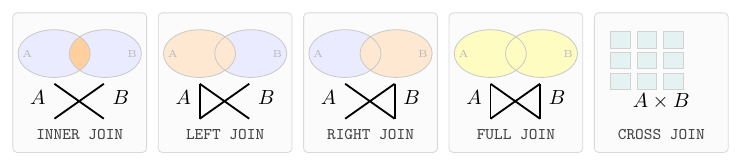
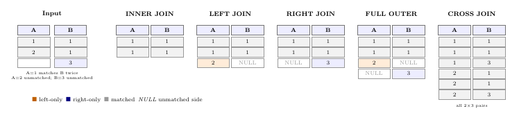
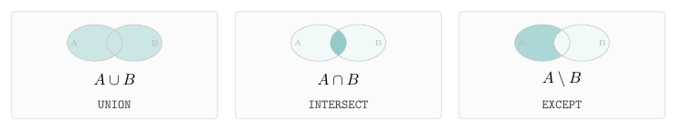

+++
title = "What is an SQL Relation?"
weight = 20
summary = "A table is a relation with storage. Every SQL query you write defines a new relation, assembled on the fly from relations that already exist."
tags = ["SQL", "Relation", "Theory", "Fundamentals"]
aliases = ["/blog/2019-09-sql-relations/"]
lab_datasets = "f1db"
+++

*A table is a relation with storage. Every SQL query you write defines a new relation, assembled on the fly from relations that already exist.*

SQL is a language for constructing relations from other relations. That sentence sounds abstract, but it has immediate, practical consequences for how you read and write queries — and for why they sometimes produce surprising row counts.

### What is a relation?

In mathematics and database theory, a *relation* is a set of tuples where every tuple conforms to the same composite type: a fixed list of named, typed attributes. PostgreSQL's word for this type is a *row type*. The relation itself is the set of rows; the row type is the schema.

Three kinds of relation appear in SQL:

- A **table** is a relation with storage. Rows are persisted to disk, managed by PostgreSQL's MVCC engine, and visible across transactions. `f1db.drivers` is a relation with storage.

- A **view** is a named relation without its own storage. Every query that references the view re-evaluates its defining SELECT. The relation exists as a definition, not as data.

- A **query result** is an anonymous, transient relation. `SELECT year, count(*) FROM f1db.races GROUP BY year` defines a relation with two attributes (`year`, `count`) and one tuple per distinct year. It materializes while the query runs and vanishes when it ends.

The crucial insight: **any SELECT statement defines a new relation**, even if you never give it a name. This is why you can use a subquery anywhere a table name is legal — a subquery *is* a relation. Named with `WITH`, it becomes a CTE. Named with `CREATE VIEW`, it becomes a view. Named with `CREATE TABLE AS`, it becomes a table. The same SELECT expression, three different storage strategies.

The query below illustrates this directly. The inner SELECT defines a transient relation — the top 3 winners by career wins. The outer SELECT joins it against `f1db.drivers` as if it were any other table, because it is:

```sql
select d.forename, d.surname, d.nationality, w.wins
  from f1db.drivers d
  join (
        select driverid, count(*) as wins
          from f1db.results
         where position = 1
         group by driverid
         order by wins desc
         limit 3
       ) w using (driverid)
 order by w.wins desc;
```

```
 forename │  surname   │ nationality │ wins
══════════╪════════════╪═════════════╪══════
 Michael  │ Schumacher │ German      │   91
 Lewis    │ Hamilton   │ British     │   57
 Alain    │ Prost      │ French      │   51
(3 rows)
```

The subquery and the table are indistinguishable to the planner — both are just relations to join.

### Building relations from relations

SQL offers two classes of operation for composing relations:

**Join operators** combine two relations *horizontally*, pairing tuples from one relation with tuples from another according to a join condition. For every pair of tuples that satisfies the condition, one output tuple is produced containing the combined attributes of both input tuples.

The most important thing to understand about joins: **the output cardinality is determined by the number of matching pairs, not by the size of either input**. If one `drivers` row matches twenty `results` rows, the join produces twenty output tuples — each carrying the driver's attributes alongside one race result. This is not a bug. It is the definition of a join. The question is always: *is that fan-out what you intended?*

<figure>
  
  <figcaption>The five join types. Each cell shows which portion of A and B is kept in the output. The bowtie symbol is standard SQL join notation: a vertical bar on the preserved side marks an outer join.</figcaption>
</figure>

<figure>
  
  <figcaption>The same five join types on concrete data: A = {1, 2}, B = {1, 1, 3}. A=1 matches two B rows — the join produces two output rows for that pair. Orange = left-only rows, blue = right-only rows, grey = matched rows. NULL fills the unmatched side in outer joins.</figcaption>
</figure>

**Set operators** (`UNION`, `INTERSECT`, `EXCEPT`) combine two relations *vertically*, requiring both relations to expose the same attribute types. `UNION ALL` concatenates all tuples from both relations. `INTERSECT` keeps only tuples present in both. `EXCEPT` removes from the first relation any tuple that appears in the second.

<figure>
  
  <figcaption>The three set operators. Unlike joins, set operators stack rows rather than pairing them — no fan-out. Both sides must expose the same column types.</figcaption>
</figure>

Because every SELECT defines a relation, every SQL query is an expression in a small algebra of relational operations. JOINs, aggregations, window functions, set operations — they all produce new relations from existing ones. Understanding this makes SQL compositional rather than magical.
